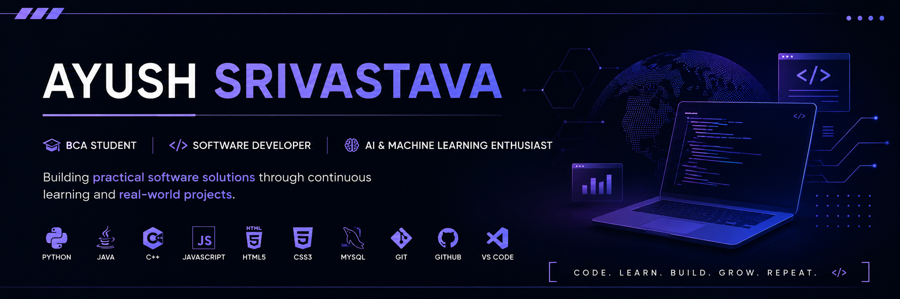

  

  

<h1 align="center">Hi 👋, I'm Ayush Srivastava</h1>

<h3 align="center">BCA Student • Software Developer • AI & Machine Learning Enthusiast</h3>

Passionate about building practical software, solving real-world problems, and continuously learning modern technologies.

---

# 🚀 About Me

- 🎓 Bachelor of Computer Applications (BCA) Student
- 💻 Passionate about Software Development
- 🤖 Exploring Artificial Intelligence & Machine Learning
- 🌱 Currently learning Full Stack Development & Backend Development
- 📚 Improving Data Structures & Algorithms
- 🚀 Interested in Open Source and Real-World Projects
- 🎯 Goal: Become a skilled Software Engineer and AI Developer

---

# 🛠️ Tech Stack

---

# 🚀 Featured Projects

## 🚁 InsectDrone

Nano Surveillance System for Military Operations using AI and Computer Vision.

**Tech Stack**

`Python` • `OpenCV` • `Machine Learning`

---

## 🤖 Universal Smart Assistant

AI-powered intelligent assistant with multiple reasoning capabilities.

**Tech Stack**

`Python` • `FastAPI`

---

## 📊 IntelleSense

Machine Learning based Sentiment Analysis Platform.

**Tech Stack**

`Python` • `Machine Learning`

---

## 👶 YouTube Kids Extension

AI-powered Chrome Extension for safer content discovery.

**Tech Stack**

`JavaScript` • `HTML` • `CSS`

---

# 📈 GitHub Statistics

---

# 🏆 GitHub Achievements

---

# 📊 Contribution Graph

---

# 🌱 Currently Learning

- Data Structures & Algorithms
- Machine Learning
- Backend Development
- Full Stack Development
- Open Source Contribution

---

# 🎯 Goals for 2026

- ✅ Build high-quality software projects
- ✅ Strengthen DSA & Problem Solving
- ✅ Learn Modern AI Technologies
- ✅ Contribute to Open Source
- ✅ Secure a Software Development Internship

---

# 📫 Connect With Me

---

## ⭐ Thanks for visiting my profile!

### *"Code. Learn. Build. Improve. Repeat."*

